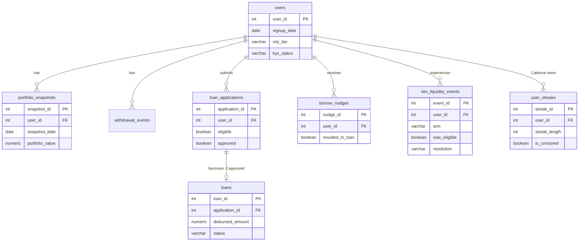
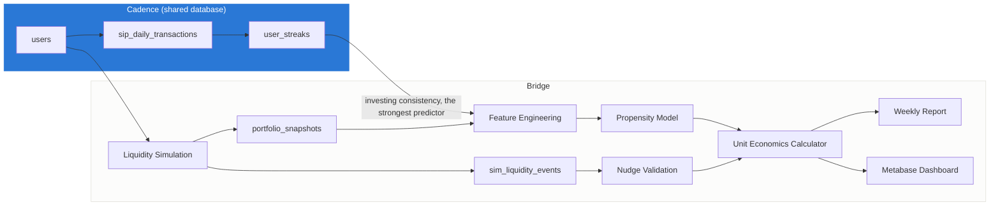
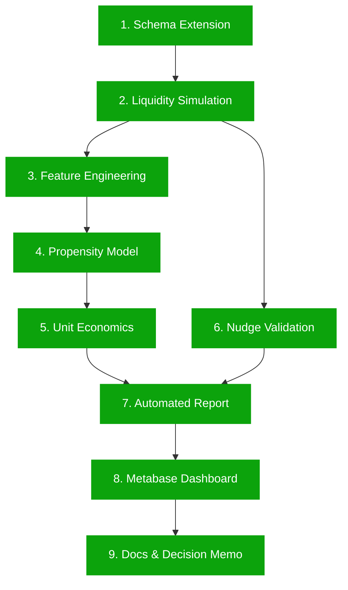
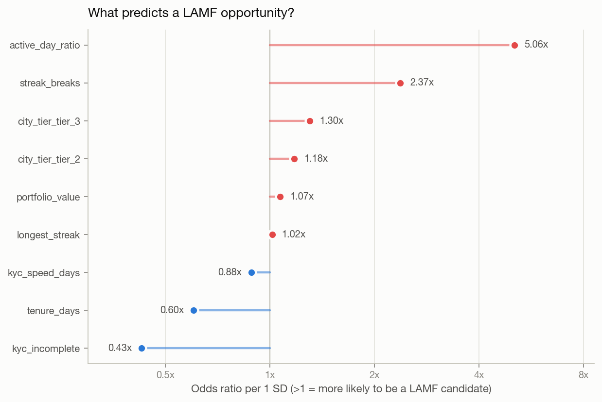
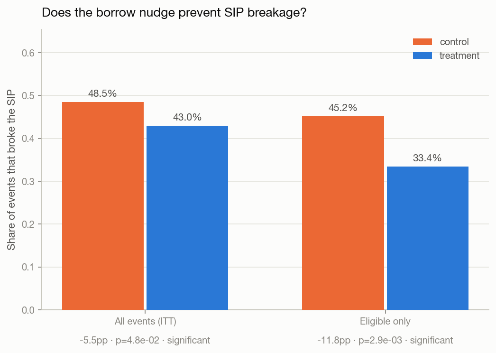

<div align="center">

# Bridge

### LAMF Cross-Sell & Unit Economics Engine

The decision layer for BlinkMoney's core monetization mechanic: *borrow instead of break.*

[](https://github.com/Navneet-Scaler/bridge/actions/workflows/ci.yml)
[](https://github.com/Navneet-Scaler/bridge/releases)
[](https://github.com/Navneet-Scaler/bridge/actions/workflows/ci.yml)
[](.python-version)
[](https://github.com/psf/black)
[](LICENSE)

**[Live Findings](https://navneet-scaler.github.io/bridge/)** &nbsp;·&nbsp;
**[Decision Memo](MEMO.md)** &nbsp;·&nbsp;
**[Assumptions](ASSUMPTIONS.md)** &nbsp;·&nbsp;
**[Dashboard Notes](dashboards/metabase_notes.md)** &nbsp;·&nbsp;
**[Quickstart](#quickstart--setup)**

</div>

<br>

## Project Overview

BlinkMoney's pitch to its users is simple: don't break a SIP to raise cash,
borrow against it instead, up to 80% of portfolio value at 9.99% p.a., while
the portfolio keeps compounding. Every user who withdraws instead of
borrowing is AUM the company loses. Every user who borrows instead is AUM
retained plus a lending relationship.

Bridge is the analytics layer that decides who to offer that loan to, whether
it is worth offering, and whether nudging someone toward it actually changes
their behaviour. It scores users on LAMF candidacy with an explainable
propensity model, prices the loan book under named and sourced assumptions,
validates the borrow-instead-of-withdraw nudge with a randomised comparison,
and reports on the pipeline automatically every week.

It is the second module in a two-repo suite, built on the same shared
database as [**Cadence**](https://github.com/Navneet-Scaler/cadence), the
daily SIP habit and retention engine. Bridge does not stand alone; see
[Architecture](#architecture--schema) for exactly why and how.

<br>

## Live Links

| Link | What it is |
|---|---|
| **[Live Findings](https://navneet-scaler.github.io/bridge/)** | A static site rebuilt from the pipeline's own output. Every number on it traces to a committed test or a live database query, not a hand-typed figure. |
| **[Decision Memo](MEMO.md)** | One page. Answers "if we push LAMF harder, who do we target and what happens to revenue" directly. |
| **[Dashboard Notes](dashboards/metabase_notes.md)** | Eight Metabase cards, provisioned from committed SQL, with the current numbers each one returns. |
| **[Quickstart](#quickstart--setup)** | Run the whole pipeline locally in under ten commands. |
| **[GitHub Releases](https://github.com/Navneet-Scaler/bridge/releases)** | Tagged versions, `v1.0.0` onward. |

<br>

## Problem Statement (Why This Exists)

A founder asking "should we push LAMF harder" is really asking three separate
questions, and most portfolio projects only attempt one of them:

1. **Who is a good LAMF candidate**, and can that be predicted from behaviour
   the company already observes, rather than guessed at?
2. **What does scaling disbursal actually do to revenue and risk**, under
   assumptions that are named and defensible rather than invented on the
   spot and presented as fact?
3. **Does the intervention work**, when it is actually run as a controlled
   comparison rather than assumed to work because the pitch sounds good?

Bridge answers all three against one shared, honestly-documented data layer,
and states plainly which numbers are real product facts, which are reasoned
from industry structure, and which are simply assumed for the sake of having
a working model. See [`ASSUMPTIONS.md`](ASSUMPTIONS.md).

<br>

## Key Answer / Outcome

> **This cohort cannot support LAMF at real market economics, consistency
> beats collateral five to one as a targeting signal, and the borrow nudge
> works today regardless of either fact.**

| | |
|---|---|
| **Median portfolio in this cohort** | Rs 862, against a Rs 25,000 industry minimum ticket |
| **Breakeven ticket, derived independently** | Rs 22,857, within 9% of the industry figure, from cost structure alone |
| **Top propensity predictor** | `active_day_ratio` at 5.06x per SD, vs `portfolio_value` at 1.07x |
| **Nudge effect on SIP breakage** | -11.8 percentage points among eligible users (p = 0.0029) |

Full reasoning in [`MEMO.md`](MEMO.md). The short version: every revenue
figure this project produces should be read as an upper bound on a book that
could not be written today, not as a forecast.

<br>

## Architecture / Schema

Bridge extends Cadence's schema rather than owning a database of its own.
Its tables carry foreign keys into Cadence's `users` table, and its
propensity model reads Cadence's `user_streaks` output directly as a feature
source, so investing consistency is never re-derived with a subtly different
definition.





Because of this dependency, **Bridge cannot run standalone.** Cadence must
already exist locally with `users`, `sip_daily_transactions`, and
`user_streaks` populated before Bridge's simulation or feature engineering
can run. There is no synthetic fallback for a reviewer who only wants to run
this repository in isolation; the honest option is to say so directly rather
than hide it, and to make the two-repo setup as short as the commands below.

<br>

## Quickstart & Setup

```bash
# ---- 1. Cadence must be running first (in the Cadence repo) ----
git clone https://github.com/Navneet-Scaler/cadence.git && cd cadence
make setup && make db-up && make schema && make run-sim && make streak

# ---- 2. Then, in this repo ----
git clone https://github.com/Navneet-Scaler/bridge.git && cd bridge
make setup        # venv, dependencies, pre-commit hooks
cp .env.example .env

make schema       # apply Bridge's schema extension on top of Cadence's
make run-sim       # portfolio growth + liquidity events + treatment/control
make features       # build the leakage-safe propensity feature set
make train-model      # fit and evaluate the propensity model
make economics          # unit economics calculator + scenario table
make nudge                 # treatment/control significance test
make report                   # weekly pipeline health report
make dashboard                   # provision the Metabase dashboard

# ---- or run the whole thing end to end ----
make all
```

```bash
make test    # 112 tests
make lint    # ruff + black --check
make fmt     # auto-format
```

<br>

## Pipeline Workflow



Every phase above shipped as its own pull request into `dev`, merged only
after CI passed (`black`, `ruff`, `pytest`), then `dev` merged into `main`
and tagged. Full history: [closed PRs](https://github.com/Navneet-Scaler/bridge/pulls?q=is%3Apr+is%3Aclosed) · [CI runs](https://github.com/Navneet-Scaler/bridge/actions).

<br>

## Core Analysis

### Propensity model: who is a LAMF candidate

Logistic regression, chosen deliberately over a stronger black-box model.
The output here is an argument made to a small team about who to approach
first, and the point is that a coefficient can be read, agreed with, or
challenged.

| Metric | Value |
|---|---|
| ROC-AUC (held out) | **0.870** |
| Average precision | 0.369 (base rate 11.1%) |
| Precision at top 100 users | 39.0% (3.5x random) |

<p align="center">
  
</p>

| Feature | Odds ratio (per 1 SD) | Direction |
|---|---|---|
| `active_day_ratio` | **5.06x** | increases odds |
| `streak_breaks` | 2.37x | increases odds |
| `city_tier_tier_3` | 1.30x | increases odds |
| `portfolio_value` | 1.07x | increases odds |
| `tenure_days` | 0.60x | decreases odds |
| `kyc_incomplete` | 0.43x | decreases odds |

A multicollinearity check (VIF) caught and removed `successful_days`, whose
inclusion had been producing a contradictory sign against the closely
related `active_day_ratio`; every remaining feature now has VIF under 10.

### Unit economics: what scaling this actually costs

Every business number is tagged `PRODUCT`, `INDUSTRY`, or `ASSUMED` in
[`ASSUMPTIONS.md`](ASSUMPTIONS.md), never presented as researched fact.

| Scenario | Loans | Avg ticket | Net revenue |
|---|---|---|---|
| Pessimistic | 344 | Rs 648 | -Rs 82,839 |
| Base | 650 | Rs 792 | -Rs 150,595 |
| Optimistic | 956 | Rs 936 | -Rs 214,228 |

The optimistic case loses the most, not the least, because more loans
multiply a fixed per-loan servicing cost on a book whose tickets are far
below breakeven. Portfolio maturity, not disbursal rate, is the lever that
matters:

| Avg portfolio | Net revenue / loan | Viable |
|---|---|---|
| Rs 1,800 (today) | -Rs 232 | No |
| Rs 10,000 | -Rs 194 | No |
| Rs 50,000 | -Rs 9 | No |
| **Rs 75,000** | **+Rs 107** | **Yes** |

### Nudge validation: does "borrow instead of withdraw" work

<p align="center">
  
</p>

| Population | Control | Treatment | Difference | 95% CI | p |
|---|---|---|---|---|---|
| ITT (all events) | 48.5% | 43.0% | -5.5pp | -10.9 to -0.1 | 0.048 |
| **Among eligible** | **45.2%** | **33.4%** | **-11.8pp** | **-19.3 to -4.0** | **0.0029** |

Randomisation balance was checked before any outcome was examined: arms
were statistically indistinguishable on eligibility (p = 0.88) and on the
size of the cash need (p = 0.42), which is what licenses reading the
difference above as causal rather than as selection.

<br>

## Dashboard

Eight Metabase cards, provisioned entirely from
[`sql/dashboard_questions.sql`](sql/dashboard_questions.sql) through
[`scripts/provision_metabase.py`](scripts/provision_metabase.py), never
clicked together by hand. A card built in the Metabase UI lives only in its
own application database and cannot be reviewed or diffed; this dashboard is
rebuilt from source on every run, and reuses Cadence's existing database
connection rather than registering a duplicate one against the same
Postgres instance.

| # | Card | Decision it supports |
|---|---|---|
| 1 | LAMF funnel, last 12 weeks | Applications to eligible to approved to disbursed, one source |
| 2 | Disbursal rate vs the assumed band | Same band the automated weekly report alerts on |
| 3 | Loan book by status | Active / closed / defaulted, and the value in each |
| 4 | Nudge outcome by arm | Raw counts behind the significance test above |
| 5 | SIP breakage by arm | What it cost users not to borrow |
| **6** | **Avg ticket vs market minimum** | **Is this book viable to lend against at all** |
| 7 | Collateral coverage by threshold | Live version of the eligibility constraint |
| 8 | Net revenue at actuals | Quick read on the current book's fee revenue |

Full setup and current numbers: [`dashboards/metabase_notes.md`](dashboards/metabase_notes.md).

<br>

## Key Findings

**1. This cohort cannot support LAMF at market-standard economics.**
Median portfolio Rs 862, maximum Rs 11,841, against a Rs 25,000 industry
minimum ticket. Discovered by the simulation generating zero eligible users
at the real threshold on the first run, not assumed. The unit economics
calculator's independently-derived breakeven ticket (Rs 22,857) and a live
collateral-coverage query both land on the same wall by unrelated routes.

**2. Investing consistency predicts LAMF candidacy five times better than
portfolio size.** The direct payoff of feeding Cadence's streak data into
this model instead of scoring on AUM alone.

**3. The borrow-instead-of-withdraw nudge measurably works**, cutting SIP
breakage by 11.8 percentage points among users who can act on it, with a
statistically significant result on a balanced, randomised comparison. This
finding does not depend on resolving the collateral problem above; it is
good news today.

<br>

## Repository Layout

```
sql/schema_extension.sql          Five LAMF tables + views, extends Cadence
sql/dashboard_questions.sql       Every Metabase card as a runnable query
src/simulate/                     Portfolio growth, liquidity events, treatment/control
src/modeling/                     Leakage-safe features + the propensity model
src/economics/                    The unit economics calculator
src/analysis/                     Nudge validation (z-tests) + shared chart styling
src/reporting/                    The weekly automated pipeline report
scripts/provision_metabase.py     Builds the dashboard from sql/dashboard_questions.sql
tests/                            112 tests, one file per module above
docs/                             This README's live findings page (GitHub Pages)
ASSUMPTIONS.md                    Every business number, tagged PRODUCT/INDUSTRY/ASSUMED
MEMO.md                           The one-page decision memo
CHANGELOG.md                      What shipped, phase by phase
dashboards/metabase_notes.md      Dashboard setup and current numbers
```

<br>

## Technology Stack

| Layer | Tool |
|---|---|
| Database | PostgreSQL 16, shared with Cadence |
| Analysis | Python 3.12, pandas, numpy |
| Modelling | scikit-learn (logistic regression, chosen for explainability) |
| Statistics | scipy, statsmodels (two-proportion z-tests, VIF, Newcombe intervals) |
| Visualisation | matplotlib, a shared validated palette module |
| Dashboard | Metabase, provisioned via its REST API from committed SQL |
| CI/CD | GitHub Actions: black, ruff, pytest on every pull request |
| Environment | python-dotenv, `.env.example` committed, real credentials never committed |

**Engineering discipline this repo follows throughout:**

- **Reproducible data generation.** Every simulated dataset is seeded
  (`SIM_RANDOM_SEED`) and regenerated from a committed script, never
  committed itself.
- **Environment-based configuration.** No hardcoded host, port, or
  credential anywhere in `src/`; everything reads from `.env` via
  `python-dotenv`, with fail-fast errors naming the missing variable.
- **Controlled database reseeding.** `truncate_bridge_tables()` clears only
  Bridge's own tables and deliberately never cascades into Cadence's
  `users`, so a Bridge re-run cannot renumber and orphan Cadence's
  identifiers.
- **CI/CD on every pull request.** Format, lint, and the full test suite
  run before merge; nothing lands on `dev` or `main` red.
- **Automated testing.** 112 tests, hand-checked fixtures, no reliance on a
  live database in the test suite itself.
- **Leakage validation.** The feature set has a dedicated test asserting
  the built features are byte-identical whether or not a mountain of
  post-cutoff activity is appended to the input, and a second test that
  actively poisons the frame with a forbidden column to confirm the guard
  fires.
- **Collinearity checks.** Every propensity model fit computes and logs a
  VIF table; a feature above the threshold is flagged rather than silently
  trusted.
- **Randomisation balance checks.** The nudge comparison verifies the two
  arms are statistically indistinguishable on pre-treatment covariates
  before the outcome is examined, not after.

<br>

## Documentation

| Document | Contents |
|---|---|
| [`MEMO.md`](MEMO.md) | The one-page decision memo |
| [`ASSUMPTIONS.md`](ASSUMPTIONS.md) | Every business number, provenance-tagged |
| [`CHANGELOG.md`](CHANGELOG.md) | What shipped and what was found, phase by phase |
| [`dashboards/metabase_notes.md`](dashboards/metabase_notes.md) | Dashboard setup and current live numbers |
| [Live Findings](https://navneet-scaler.github.io/bridge/) | Rebuilt static summary of the above |

<br>

## A Note on the Numbers

BlinkMoney's real take rate, margin structure, and default experience are
not public. Every business input in this repository is an explicitly
labelled assumption, declared as a named constant tagged `PRODUCT`,
`INDUSTRY`, or `ASSUMED`, and documented in
[`ASSUMPTIONS.md`](ASSUMPTIONS.md). The most consequential of these, a
Rs 2,000 simulated eligibility threshold roughly 12x under the real market
minimum, is the reason every revenue figure in this repository should be
read as an upper bound, not a projection.

<br>

## License

[MIT](LICENSE)
